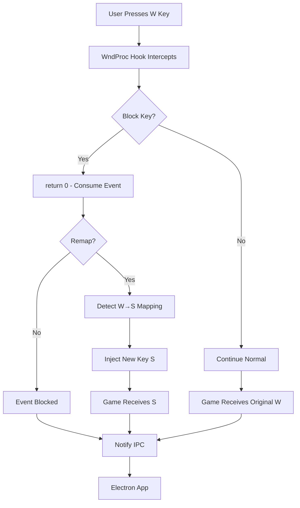
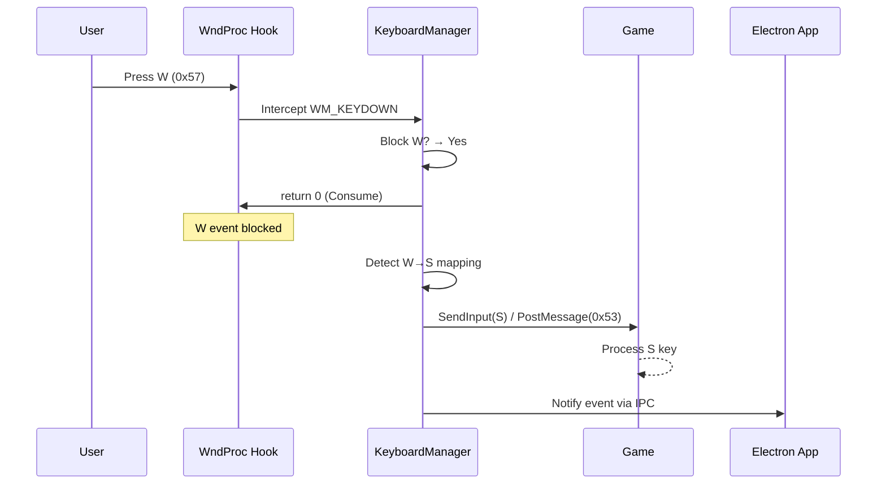

# Keyboard Module - Keyboard Event Interception Plan

## Current Architecture (Already Implemented)

- **DLL Injection**: n_overlay.dll injected into game process
- **API Hooking**: Detours intercepts GetAsyncKeyState, GetKeyState, GetKeyboardState
- **IPC**: Communication between game and Electron app via JSON messages
- **Input Blocking**: System to block original game input

## Components to Implement

### JAVASCRIPT INTERFACE (overlay-api.lib.ts)

```typescript
// Remapping and Prevention APIs
setKeyMapping(originalKey: number, newKey: number): void;  // W → S
removeKeyMapping(originalKey: number): void;
clearAllMappings(): void;

// Blocking APIs
 blockKeys(keyCodes: number[], block: boolean): void;

// Mode APIs
setInterceptMode(mode: 'block_and_replace' | 'block_only' | 'monitor' | 'selective_remap'): void;

// Event APIs (already existing)
onKeyDown(callback: (keyCode: number, modifiers: number, originalKey?: number) => void);
onKeyUp(callback: (keyCode: number, modifiers: number, originalKey?: number) => void);
sendKey(keyCode: number, modifiers?: number): void;

// Usage example:
// this.overlayApiLib.setKeyMapping(0x57, 0x53); // W → S
// this.overlayApiLib.setInterceptMode('block_and_replace');
// this.overlayApiLib.blockKey(0x1B, true); // Block ESC
```

## Interception and Remapping Flow



**Practical Example of W→S Remapping:**



## System States (Interception Modes)

- **DISABLED**: No interception, normal operation
- **BLOCK_AND_REPLACE**: Blocks original key + injects new (remapping)
- **BLOCK_ONLY**: Only blocks keys, no injection
- **MONITOR_ONLY**: Captures events without blocking (information only)
- **SELECTIVE_REMAP**: Only remaps configured keys, rest passes through

## Critical Interception Points (By Priority)

1. **WndProc Hook** - MAXIMUM PRIORITY - Intercepts BEFORE game
2. **GetAsyncKeyState/GetKeyState** - Already implemented - For games that query state
3. **DirectInput Hook** - For games using DirectInput APIs
4. **RawInput Hook** - For games that register Raw Input

## Technical Considerations

- **Performance**: Circular buffer for events, queue limit
- **Compatibility**: Support for DX9/10/11/12, Win32/DirectInput/RawInput
- **Security**: Validation of injected events
- **Threading**: Synchronous hooks, asynchronous processing
